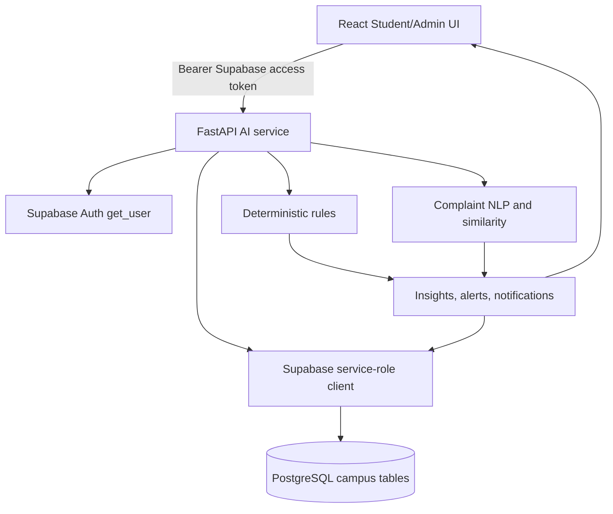

# CampusPulse AI Service

Separate FastAPI automation service for the existing React + Supabase application. It does not replace the frontend or Supabase. The backend uses the Supabase service-role client only on the server, validates the caller's Supabase bearer token, loads the caller's `profiles.role`, and applies student/admin authorization before returning data.

## Architecture and data flow


```mermaid
flowchart TD
  UI[React Student/Admin UI] -->|Bearer Supabase access token| API[FastAPI AI service]
  API --> AUTH[Supabase Auth get_user]
  API --> DB[Supabase service-role client]
  DB --> CORE[(PostgreSQL campus tables)]
  API --> RULES[Deterministic rules]
  API --> NLP[Complaint NLP and similarity]
  RULES --> OUT[Insights, alerts, notifications]
  NLP --> OUT
  OUT --> DB
  OUT --> UI
```

Attendance uses the configured threshold, and recent `attendance_history` records identify continuously decreasing attendance. Complaint analysis uses keyword classification, location extraction, text similarity, and escalation rules. Rules are the default; setting `AI_PROVIDER=openai` and a server-only `OPENAI_API_KEY` enables structured OpenAI classification and admin copilot answers, with automatic rules fallback if the provider is unavailable. The mess forecast combines room capacity, approved leave, day/date context, and feedback volume, and always returns uncertainty.

## Setup

1. Run the existing `supabase/schema.sql` in Supabase.
2. Run `supabase/production_hardening.sql` to secure profile roles and live request workflows.
3. Run `supabase/complaints_realtime.sql` to enable the secured live complaint workflow.
4. Run `supabase/ai_engine.sql` to add history, AI analysis, clusters, forecasts, and notification priority.
5. Run `supabase/web_push.sql` to create the browser-subscription table.
6. Create a backend environment file:

```powershell
Copy-Item backend/.env.example backend/.env
```

Set `SUPABASE_URL`, `SUPABASE_SERVICE_ROLE_KEY`, and `CORS_ORIGINS`. Never expose the service-role key to React or commit `.env`.

For Android/browser system notifications, generate a VAPID key pair with `npx web-push generate-vapid-keys` and set `VAPID_PUBLIC_KEY`, `VAPID_PRIVATE_KEY`, and `VAPID_SUBJECT` in the backend environment. Keep the private key only on the backend. Deploy the frontend over HTTPS; each student must sign in, open Notifications, select **Enable alerts**, and allow notifications in the browser. Notice pushes go only to subscribed students matching the notice target.

7. Install and run:

```powershell
py -3.11 -m venv .venv
.\.venv\Scripts\Activate.ps1
pip install -r backend/requirements.txt
uvicorn backend.main:app --reload --port 8000
```

Run these commands from the repository root so the `backend` package imports resolve correctly.

Health check: `GET http://localhost:8000/health`. OpenAPI: `http://localhost:8000/docs`.

## API endpoints

All protected endpoints require `Authorization: Bearer <supabase-access-token>`.

| Method | Endpoint | Access | Purpose |
|---|---|---|---|
| GET | `/health` | public | Service health |
| GET | `/api/attendance/me` | student/admin token | Caller-scoped attendance warnings |
| POST | `/api/attendance/analyze` | admin | Analyze all students and create warnings |
| POST | `/api/complaints/classify` | student/admin token | Classify complaint text for the current form |
| POST | `/api/complaints/analyze` | admin | Classify complaints and return incident clusters |
| GET | `/api/mess/forecast` | admin | Meal demand forecast and uncertainty |
| GET | `/api/insights/action-center` | admin | Structured dashboard summary |
| POST | `/api/assistant/admin` | admin | Natural-language campus copilot |
| POST | `/api/assistant/student` | student | Caller-only assistant data |
| GET | `/api/notifications/me` | caller | Caller-only notifications |
| POST | `/api/notifications/admin` | admin | Create an authorized notification |
| GET | `/api/notifications/push-public-key` | public | VAPID public key for browser subscription |
| POST | `/api/notifications/push-subscription` | caller | Save the caller's browser push subscription |
| DELETE | `/api/notifications/push-subscription` | caller | Remove the caller's browser push subscription |
| POST | `/api/notifications/push-notice` | admin | Send a targeted notice to subscribed browsers |

## Example requests

```bash
curl -X POST http://localhost:8000/api/attendance/analyze \
  -H "Authorization: Bearer $SUPABASE_ACCESS_TOKEN"
```

```json
{
  "analyzed": 1,
  "warnings": [{
    "student_id": "uuid",
    "attendance": 68,
    "required": 75,
    "risk": "HIGH",
    "reason": "Attendance is below required threshold",
    "decreasing": false
  }]
}
```

```bash
curl -X POST http://localhost:8000/api/assistant/admin \
  -H "Authorization: Bearer $ADMIN_TOKEN" \
  -H "Content-Type: application/json" \
  -d '{"question":"How many students have attendance below 75%?"}'
```

Student requests are always filtered by the authenticated profile ID. The service never includes another student's name or academic data in a student response.

## React connection

Keep Supabase auth in React. Send the current Supabase session access token to the service:

```js
const { data: { session } } = await supabase.auth.getSession()
const response = await fetch(`${import.meta.env.VITE_AI_API_URL}/api/insights/action-center`, {
  headers: { Authorization: `Bearer ${session.access_token}` }
})
const actionCenter = await response.json()
```

Set `VITE_AI_API_URL=http://localhost:8000` in the React environment. Do not send the service-role key from the browser.

## Deployment

Deploy the backend as a Python web service with a start command such as `uvicorn backend.main:app --host 0.0.0.0 --port $PORT`. Configure the Supabase URL, service-role key, CORS origin, and rate limit as platform secrets. Use HTTPS, restrict CORS to the deployed React origin, and rotate the service-role key if it is ever exposed.

## Demo data

Use the commented Room 205 inserts at the end of `supabase/ai_engine.sql` with real profile UUIDs. Add multiple attendance history rows for the same student, for example 78, 72, and 68, to demonstrate a decreasing MEDIUM/HIGH warning. Add three Room 205 water complaints from different student IDs to demonstrate one HIGH incident cluster rather than three independent admin alerts.
